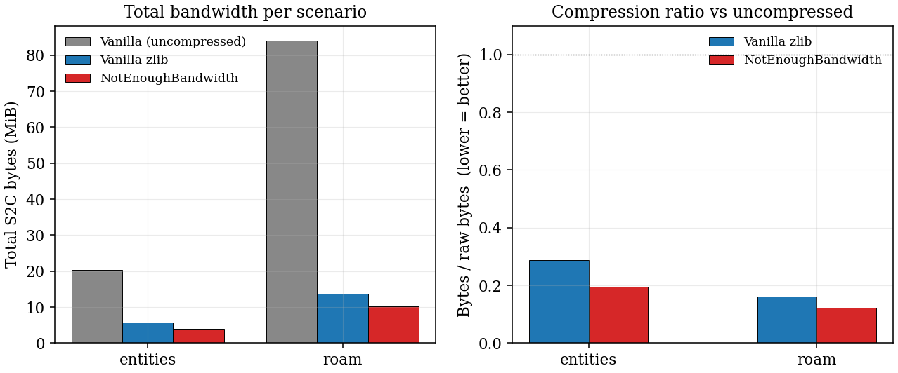
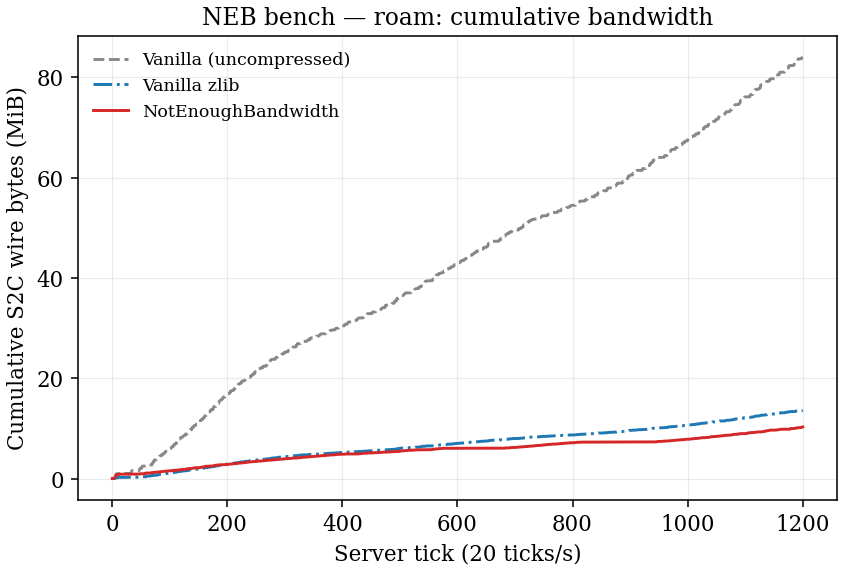
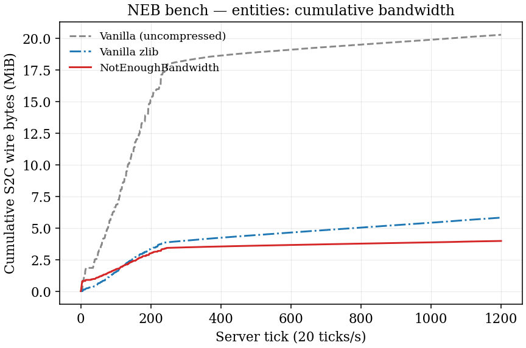
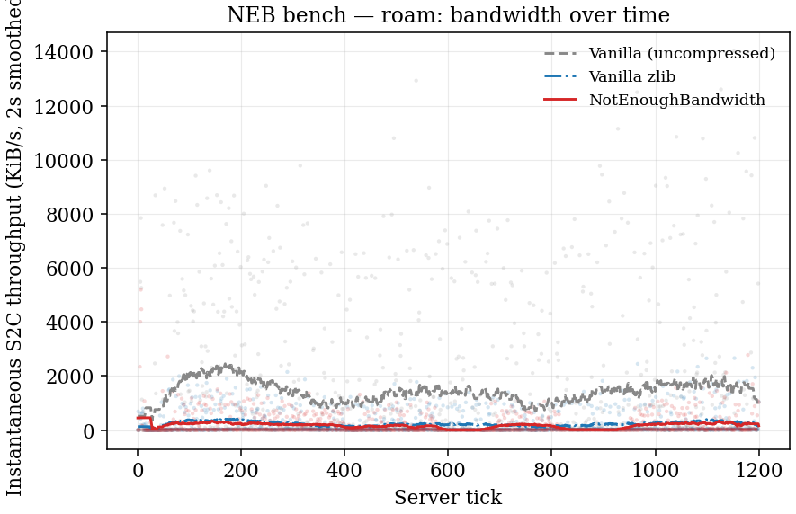
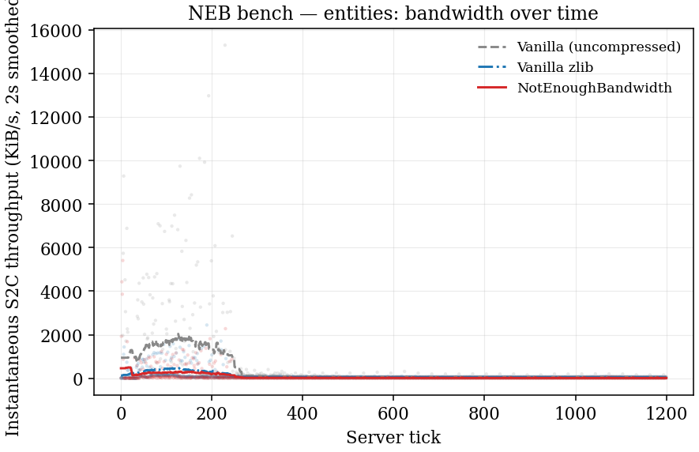

# Not Enough Bandwidth (NEB) — Fabric Port

**Fabric mod for Minecraft 1.21.11** — Network bandwidth optimization through packet header indexing, aggregation + Zstd compression, delayed chunk caching, persistent client-side chunk deduplication, and chunk light stripping.

> [!NOTE]
> Pre-release versions may include experimental features for early testing. If you want to try new features before they are officially released, download a [pre-release](https://github.com/RMS-Server/NotEnoughBandwidth/releases). Otherwise, stick to the latest stable release.

> **Need support or a port for another version?**
> Open an [issue](https://github.com/RMS-Server/NotEnoughBandwidth/issues), join QQ group **362669270** ([invite link](https://qm.qq.com/q/Ch5CGWyjjc)), or email [support@rms.net.cn](mailto:support@rms.net.cn).

> This is an unofficial Fabric port of the original [NeoForge mod](https://github.com/USS-Shenzhou/NotEnoughBandwidth) by USS_Shenzhou.
> If you want to contribute to the upstream project, please discuss with USS_Shenzhou on [Discord](https://discord.gg/ZAn7U2BJpb) first.

## Introduction

NEB uses various methods to save as much network traffic as possible during Minecraft gameplay, while remaining transparent to both mods and players.

In the TeaCon Jiachen dataset, compared to raw uncompressed data, NEB can theoretically reduce the server's outbound traffic to **7.6%** of its original size. For comparison, the outbound traffic of Vanilla's default compression mechanism is 39% of the original data size.

In tests conducted in a Vanilla environment, the server outbound traffic was reduced to **18%** of its original size. As the number of installed mods increases, compression performance improves.

Press **N** in-game to view the network traffic status.

## Benchmark

Reproducible head-to-head (NEB vs vanilla zlib vs vanilla raw) over two scenarios, 60 s per cell, on a dedicated loopback setup. Zstd level 12. Full reproduction: `./gradlew benchmark` + `python3 scripts/plot_benchmark.py build/benchmark`.







<details>
<summary>Instantaneous throughput scatter (click to expand)</summary>





</details>

## Main Features

### Compact Packet Header

Optimizes `CustomPacketPayload` encoding and decoding by replacing the packet header `Identifier` (Packet Type) with a compact VarInt index. This reduces the mod network packet header overhead to a fixed 3-4 bytes, instead of the length of the string corresponding to the network packet type.

> [!NOTE]
> ### Fixed 8 bits header
> ```
> +------------- 1 byte (8 bits) ---------------+
> |               function flags                 |
> +---+---+--------------------------------------+
> | i | t |      reserved (6 bits)               |
> +---+---+--------------------------------------+
> ```
> - i = indexed (1 bit)
> - t = tight_indexed (1 bit, only valid if i=1)
> - reserved = 6 bits (for future use)
>
> ### Indexed packet type
> - If i=0 (not indexed): full `Identifier` in UTF-8 follows.
> - If i=1 and t=0 (indexed, NOT tight): 3 bytes — 12-bit namespace-id + 12-bit path-id (capacity 4096 each).
> - If i=1 and t=1 (indexed, tight): 2 bytes — 8-bit namespace-id + 8-bit path-id (capacity 256 each).

### Aggregation and Compression

Optimizes the situation where vanilla often produces a large number of small network packets. Intercepts transmission at the `Connection` level, assembles them into one large network packet every 20ms, and sends it after Zstd compression.

> [!NOTE]
> ```
> +---+-----+----+----+----+----+----+----...
> | B | (S) | p0 | s0 | d0 | p1 | s1 | d1 ...
> +---+-----+----+----+----+----+----+----...
>           +--packet 1---++--packet 2---+
>           +---------compressed---------+
> ```
> - B = bool, whether compressed
> - S = varint, size of uncompressed data (only present if compressed)
> - p = prefix (medium/int/utf-8), type of this subpacket
> - s = varint, size of this subpacket
> - d = bytes, data of this subpacket

### Delayed Chunk Cache (DCC)

In Vanilla, when a player moves, the server instructs the client to immediately forget the chunks behind them; if the player returns to the original position, the full chunk data must be sent again. By delaying this "forgetting", the chunk transmission traffic generated when moving back and forth can be saved.

### Persistent Chunk Cache (PCC)

Caches chunk data persistently on the client side using a local LevelDB database, keyed by a 64-bit content hash. On each connection, the client sends a Bloom Filter of all cached chunk hashes to the server. When the server is about to send a chunk whose hash is in the filter, it sends only the 20-byte hash instead of the full packet (~10–20 KB). The client loads the chunk from its local database. On a Bloom Filter false positive, the client requests the full data as a fallback. The Bloom Filter is refreshed every 64 newly cached chunks so the optimization takes effect within the same session.

### Chunk Light Stripping

When both sides run NEB, the server omits all sky-light and block-light nibble arrays from the chunk packet — light data that vanilla ships as up to 96 KB raw per chunk. The client recomputes full-chunk lighting locally after load using the vanilla light engine, so the visual result is identical.

Measured savings in exploration workload (dedicated server): **−27% baked bandwidth per chunk**, **−48% raw bandwidth per chunk**. Light nibble arrays are near-perfectly compressible by the Zstd dictionary (≈92%), so raw savings are larger than baked savings. Standalone `light_update` delta packets (sent on block changes) are unaffected.

## Configuration

Modify the configuration file at `config/NotEnoughBandwidthConfig.json`.

### compatibleMode

> **Works independently on client and server.**

Whether to enable compatibility mode. If set to `true`, the `blackList` below will be used.

### blackList

> **Works independently on client and server.**

The blacklist for compatibility mode. Packets listed here will be skipped by NEB. You can add packets as needed.

> [!WARNING]
> To ensure packet ordering, packets in the blacklist will interrupt the ongoing aggregation. If there are many packets in the blacklist, or if the corresponding packets are sent too frequently, the efficiency of aggregation-compression will decrease.

### compressionLevel

> **Works independently on client and server.**

The Zstd compression level (integer 1-19). Default is 12. Higher values produce better compression but use more CPU. Level 12 is the balanced point between compression ratio and CPU cost in our testing; drop to 6 if your server CPU is the bottleneck, raise to 19 if CPU is idle and you want to squeeze every last byte.

### contextLevel

> **Works independently on client and server.**

The Zstd context window size (integer 21-25, representing 2-32MB). Default is 23 (8MB). Larger values result in better compression but consume more memory.

> [!TIP]
> For a server with 100 players, a setting of 25 will result in approximately 3200MB of additional memory usage.

### dccSizeLimit, dccDistance, dccTimeout

> **Server only.**

Delayed Chunk Cache (DCC) parameters: max cached chunks, cache distance, cache timeout (seconds). Larger values may consume more memory, while smaller values may trigger updates more frequently.

### chunkCacheEnabled

> **Client only.**

Whether to enable the Persistent Chunk Cache. Default is `true`.

### chunkCacheMaxSizeMB

> **Client only.**

Maximum size of the local chunk cache database in megabytes. Default is `2048` (2 GB).

### lightStripEnabled

> **Server only (requires NEB on both sides).**

Whether to strip sky-light and block-light data from chunk packets sent to NEB clients. The client recomputes lighting locally after chunk load. Default is `true`. Set to `false` to disable light stripping and revert to vanilla light delivery.

## Installation

Requires:
- Minecraft 1.21.11
- Fabric Loader >= 0.19.2
- Fabric API

**Both client and server must install NEB.** When a client without NEB connects, the server falls back to vanilla behavior for that connection.

## License

Copyright (C) 2025 USS_Shenzhou

This mod is free software under the GNU GPL 3.0. See [LICENSE](LICENSE) for details.

### Additional Permissions

As a game player, when you load and play this program in Minecraft, this license automatically grants you all rights necessary, which are not covered in the GPL-3.0 license, or are prohibited by the GPL-3.0 license, for the normal loading and playing of this program in Minecraft. In case of conflicts between the GPL-3.0 license and the Minecraft EULA or other Mojang/Microsoft terms, the latter shall prevail.
